# Documentación Técnica — Corrección de Postura en Tiempo Real

## Índice

1. [Objetivo del sistema](#1-objetivo-del-sistema)
2. [Arquitectura general](#2-arquitectura-general)
3. [Detección automática de ejercicio](#3-detección-automática-de-ejercicio)
4. [Pipeline de entrenamiento](#4-pipeline-de-entrenamiento)
   - 4.1 [Extracción de landmarks (MediaPipe)](#41-extracción-de-landmarks-mediapipe)
   - 4.2 [Cálculo de ángulos articulares](#42-cálculo-de-ángulos-articulares)
   - 4.3 [Detección de repeticiones](#43-detección-de-repeticiones)
   - 4.4 [Etiquetado de fases](#44-etiquetado-de-fases)
   - 4.5 [Construcción del vector de features](#45-construcción-del-vector-de-features)
   - 4.6 [Entrenamiento del clasificador](#46-entrenamiento-del-clasificador)
5. [Pipeline de inferencia en tiempo real](#5-pipeline-de-inferencia-en-tiempo-real)
   - 5.1 [Loop de predicción](#51-loop-de-predicción)
   - 5.2 [Generación de feedback](#52-generación-de-feedback)
   - 5.3 [Conteo de repeticiones](#53-conteo-de-repeticiones)
6. [Pipeline de evaluación](#6-pipeline-de-evaluación)
7. [Comparativa técnica por ejercicio](#7-comparativa-técnica-por-ejercicio)
8. [Modelos ML — resumen](#8-modelos-ml--resumen)
9. [Estructura de archivos y artefactos](#9-estructura-de-archivos-y-artefactos)
10. [Limitaciones conocidas](#10-limitaciones-conocidas)

---

## 1. Objetivo del sistema

El sistema clasifica en tiempo real la **fase biomecánica** de tres ejercicios de fuerza de tronco superior:

| Ejercicio | Fases | Vista cámara |
|-----------|-------|--------------|
| Wall Push-Up | 4 (inicio, descenso, abajo, subida) | Lateral |
| Dominada agarre neutro | 3 (abajo, movimiento, arriba) | Frontal |
| Dominada agarre abierto | 3 (arriba, transición, abajo) | Posterior |

Con la fase predicha, el sistema:
- Emite mensajes de corrección en pantalla si los ángulos articulares están fuera de rango
- Cuenta repeticiones mediante máquinas de estados
- Graba el video de la sesión (Wall Push-Up y Dominada Neutro)

El conocimiento de "postura correcta" proviene exclusivamente de los videos de entrenamiento grabados por el usuario. No existe un criterio biomecánico externo hardcodeado: los rangos válidos son los observados en esos videos de referencia.

---

## 2. Arquitectura general

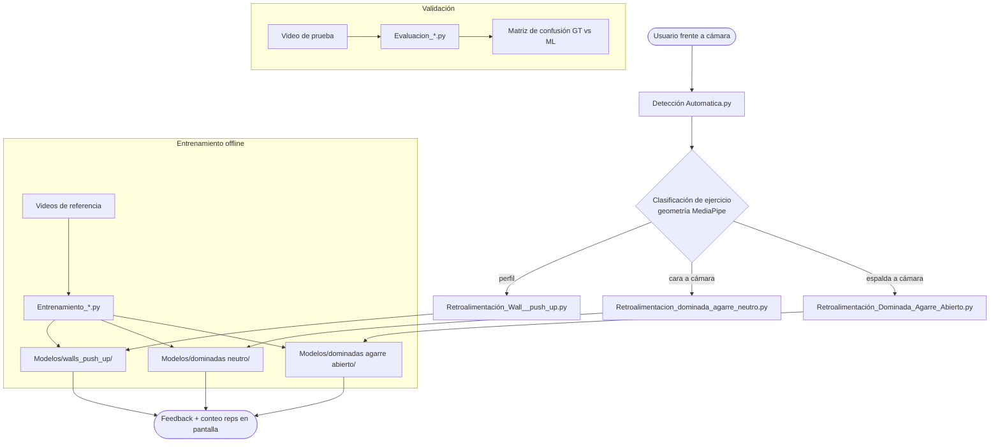

---

## 3. Detección automática de ejercicio

**Archivo:** `Detección Automatica.py`

### Lógica geométrica

MediaPipe retorna landmarks normalizados en [0,1]. Se usan tres puntos:

- `lm[0]` — nariz
- `lm[11]` — hombro izquierdo
- `lm[12]` — hombro derecho

```python
ancho_hombros  = |sho_l.x - sho_r.x| * w
centro_hombros = (sho_l + sho_r) / 2

# Regla 1: perfil → push-up
si |nariz.x - centro.x| > ancho * 0.35:
    ejercicio = "pushup"

# Regla 2: cara a cámara → dominada neutra
elif nariz.y < centro.y:
    ejercicio = "dom_neutra"

# Regla 3: espalda a cámara → dominada abierta
else:
    ejercicio = "dom_abierta"
```

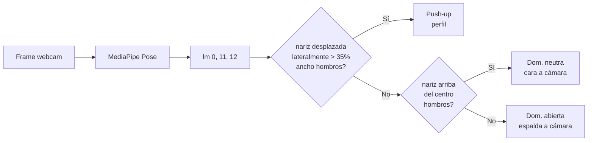

### Mecanismo de estabilización

Para evitar lanzar el script por una detección espuria, se exige **1 segundo de posición estable**:

```python
UMBRAL_MOV   = 8 px      # desplazamiento máximo permitido del hombro derecho
FPS_EST      = 25
TIEMPO_ESTABLE = 1.0 s   # = 25 frames consecutivos estables
```

Si el hombro derecho se desplaza más de 8px entre frames consecutivos, el contador de estabilidad se reinicia. Al alcanzar 1 segundo estable, muestra un countdown 3-2-1 y lanza el script con:

```python
subprocess.call([sys.executable, SCRIPTS[ejercicio]])
```

---

## 4. Pipeline de entrenamiento

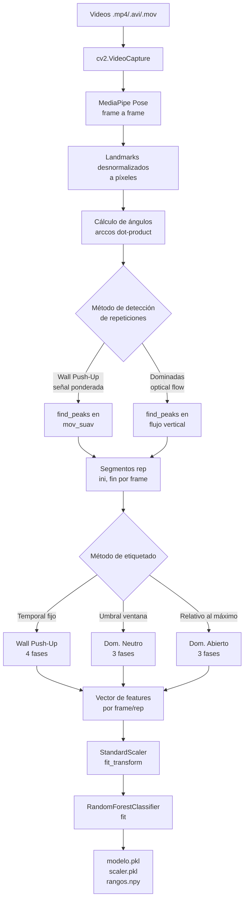

### 4.1 Extracción de landmarks (MediaPipe)

MediaPipe Pose (BlazePose) detecta 33 landmarks del cuerpo humano. Retorna coordenadas normalizadas `(x, y, z, visibility)` en rango [0,1]. El sistema solo usa las coordenadas 2D `(x, y)` desnormalizadas a píxeles:

```python
punto = [landmark.x * ancho_frame, landmark.y * alto_frame]
```

Los landmarks relevantes por índice:

```
 0 — nariz
11 — hombro izq     12 — hombro der
13 — codo izq       14 — codo der
15 — muñeca izq     16 — muñeca der
23 — cadera izq     24 — cadera der
```

### 4.2 Cálculo de ángulos articulares

Función común a todos los scripts:

```python
def calcular_angulo(a, b, c):
    ba = a - b      # vector del punto b al punto a
    bc = c - b      # vector del punto b al punto c
    coseno = dot(ba, bc) / (|ba| * |bc|)
    return degrees(arccos(clip(coseno, -1, 1)))
```

Retorna el ángulo **en el vértice `b`** entre los segmentos `b→a` y `b→c`, en grados [0°, 180°]. El `clip` evita errores numéricos por valores fuera del dominio de arccos.

```
        a
       /
      / ← ángulo θ en b
     b ————— c
```

**Ángulos calculados por ejercicio:**

```
Wall Push-Up:
  codo    = ángulo(hombro, codo, muñeca)         lm[12,14,16] lado derecho
  hombro  = ángulo(codo, hombro, cadera)         lm[14,12,24]
  espalda = ángulo(hombro, cadera, cadera)       ← BUG: vector nulo, siempre 0°

Dominada Neutro:
  codo_der = ángulo(hombro_der, codo_der, muñeca_der)   lm[12,14,16]

Dominada Abierto:
  codo_izq  = ángulo(hombro_izq, codo_izq, muñeca_izq)  lm[11,13,15]
  codo_der  = ángulo(hombro_der, codo_der, muñeca_der)  lm[12,14,16]
  apertura  = ángulo(codo_izq, hombro_izq, codo_der)    lm[13,11,14]  ← apertura hombros
  tronco    = ángulo(mid_cadera, mid_hombro, [mid_sho.x, 0])  ← inclinación vertical
  agarre    = distancia euclidiana(muñeca_izq, muñeca_der)    ← no es ángulo
```

### 4.3 Detección de repeticiones

#### Wall Push-Up — señal de movimiento ponderada

```python
# Normalización por columna al rango [0,1]
codo_norm   = (codo   - min) / (max - min)
hombro_norm = (hombro - min) / (max - min)
espalda_norm = (espalda - min) / (max - min)

# Señal escalar combinada (pesos empíricos)
mov = codo_norm * 0.6 + hombro_norm * 0.3 + espalda_norm * 0.1

# Suavizado con ventana deslizante de 9 frames
mov_suav = rolling_mean(mov, window=9)

# Detección de ciclos
picos,  _ = find_peaks( mov_suav, distance=15, prominence=0.02)
valles, _ = find_peaks(-mov_suav, distance=15, prominence=0.02)

# Cada rep = (pico_anterior_al_valle, valle)
```

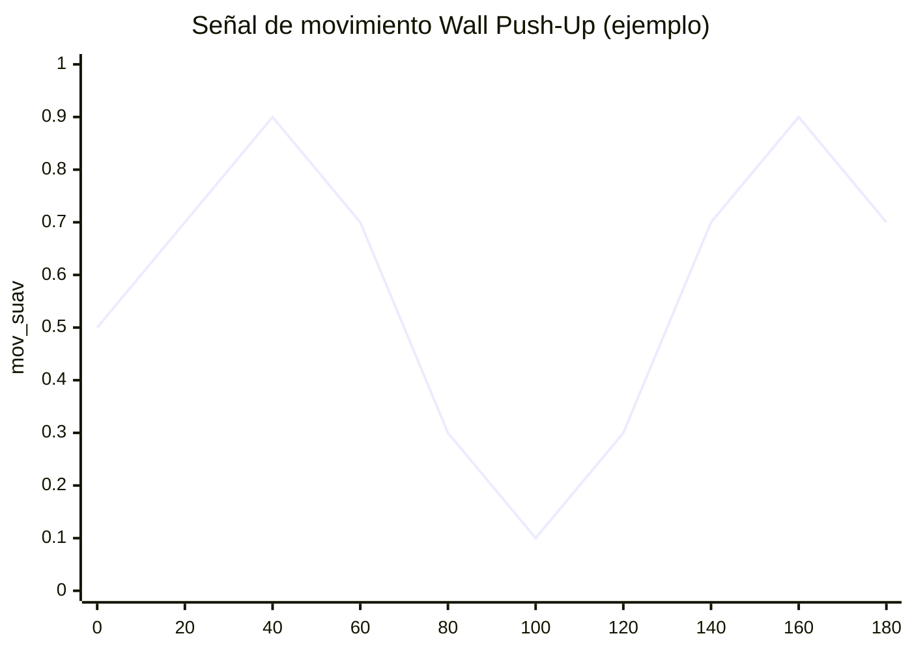

#### Dominada Neutro / Abierto — flujo óptico de Farneback

```python
flow = cv2.calcOpticalFlowFarneback(
    prev_gray, gray, None,
    pyr_scale=0.5, levels=3, winsize=15,
    iterations=3, poly_n=5, poly_sigma=1.2, flags=0
)
# Se promedia la componente Y (movimiento vertical)
mov_vertical = mean(flow[..., 1])
```

El flujo óptico de Farneback estima el campo de velocidades de cada píxel entre frames consecutivos. Al promediar la componente Y sobre toda la imagen, se obtiene una señal escalar que sube cuando el cuerpo sube y baja cuando el cuerpo baja. Los picos y valles de esta señal delimitan las repeticiones.

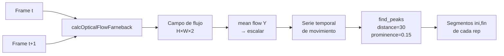

### 4.4 Etiquetado de fases

Este paso asigna una etiqueta de fase (ground truth para el entrenamiento) a cada frame dentro de un segmento de repetición. Es el paso más crítico porque define qué aprende el modelo.

#### Wall Push-Up — segmentación temporal fija

```python
length = fin - ini + 1
b2 = int(0.25 * length)   # 25% → fin fase 1
b3 = int(0.45 * length)   # 45% → fin fase 2
b4 = int(0.70 * length)   # 70% → fin fase 3

para cada frame en [ini, fin]:
    si posición_relativa ≤ b2  → Fase 1 (inicio / posición alta)
    si posición_relativa ≤ b3  → Fase 2 (descenso)
    si posición_relativa ≤ b4  → Fase 3 (posición baja)
    si posición_relativa > b4  → Fase 4 (subida)
```

> La asignación es **puramente temporal**. Los frames del 25% al 45% se etiquetan como "descenso" independientemente de si el ángulo realmente está bajando.

```
Rep:  |——Fase1——|——Fase2——|——Fase3——|————Fase4————|
      0%       25%       45%       70%           100%
```

#### Dominada Neutro — umbral sobre ventana deslizante

```python
# Ventana deslizante de los últimos 25 ángulos de codo
ang = array(ventana)
amp = max(ang) - min(ang)

si ang[-1] ≤ min + 0.20 * amp  → Fase 1 (abajo, brazos extendidos)
si ang[-1] ≥ max - 0.20 * amp  → Fase 3 (arriba, máxima contracción)
sino                            → Fase 2 (movimiento)
```

Las fases 1 y 3 se asignan solo cuando el ángulo está en el 20% inferior o superior de la amplitud registrada en la ventana. El 60% del rango central es siempre "movimiento".

#### Dominada Abierto — umbral relativo al máximo de la repetición

```python
# Se calcula el ángulo máximo alcanzado en toda la repetición
ang_max = max(angulos_en_rep)

si ang ≥ 0.75 * ang_max  → Fase 1 (arriba)
si ang ≥ 0.45 * ang_max  → Fase 2 (transición)
si ang <  0.45 * ang_max → Fase 3 (abajo)
```

### 4.5 Construcción del vector de features

#### Wall Push-Up — 3 features (agregados por fase)

```
X = [Codo_mean, Hombro_mean, Espalda_mean]
```

En lugar de features por frame, se calcula la **media de cada ángulo en el segmento de la fase**. El modelo recibe una fila por fase por repetición.

#### Dominada Neutro — 7 features por frame

```
X = [
    ang,           # ángulo codo derecho frame actual
    vel,           # (ang[t] - ang[t-1]) * fps   → vel. angular °/s
    acc,           # BUG: usa vel_hist pero calcula igual que vel
    ang_mean,      # media de ventana de 25 frames de ángulo
    vel_mean,      # media de ventana de 5 frames de velocidad
    ang_min,       # mínimo de ventana de 25 frames
    ang_max        # máximo de ventana de 25 frames
]
```

La intención es capturar no solo la posición angular sino la **dinámica temporal**: si el ángulo está subiendo/bajando rápido, en qué zona del rango de movimiento se encuentra.

#### Dominada Abierto — 41 features por frame

Para 5 señales base (`ang_l`, `ang_r`, `ang_h`, `grip`, `trunk`), se calculan 5 estadísticas de una ventana de 25 frames:

```
[last, mean, min, max, std]  × 5 señales = 25 features
```

Para 4 señales (`ang_l`, `ang_r`, `ang_h`, `hip_y`), se calculan velocidad y aceleración con sus medias:

```
vel[k]      = (hist[k][-1] - hist[k][-2]) * fps
acc[k]      = (vel_hist[k][-1] - vel_hist[k][-2]) * fps
features    = [vel_last, vel_mean, acc_last, acc_mean]  × 4 = 16 features
```

Total: **25 + 16 = 41 features**

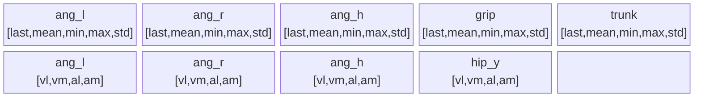

*25 estadísticas posicionales + 16 estadísticas dinámicas = 41 features*

### 4.6 Entrenamiento del clasificador

```python
# Normalización: media=0, desviación=1 por feature
scaler = StandardScaler()
X_scaled = scaler.fit_transform(X)

# Clasificador
modelo = RandomForestClassifier(
    n_estimators = 300 / 400,   # árboles
    random_state = 42,
    n_jobs       = -1,           # paralelismo
    class_weight = "balanced"   # dominadas
)
modelo.fit(X_scaled, y)
```

El `StandardScaler` es imprescindible porque los features tienen escalas muy distintas:
- Ángulos: [0°, 180°]
- Velocidades angulares: [-1000, 1000] °/s aprox.
- Distancia de agarre (grip): [0, ancho_frame] píxeles

Sin normalización, features de mayor escala dominarían las decisiones de los árboles.

**Balanceo de clases (Dominada Neutro):**

```python
# Sobremuestreo por bootstrap al tamaño de la clase mayoritaria
max_count = max(count per clase)
para cada clase c:
    idx = random_choice(len(Xc), size=max_count, replace=True)
    Xc_balanced = Xc[idx]
```

**Artefactos guardados:**

| Archivo | Descripción |
|---------|-------------|
| `modelo_*.pkl` | RandomForestClassifier serializado con joblib |
| `scaler_*.pkl` | StandardScaler serializado — debe usarse con el mismo orden de features |
| `rangos_por_fase.npy` | Dict `{fase: {ángulo: {min, max, mean}}}` para feedback |
| `dataset_*.csv` | Datos de entrenamiento (para inspección) |

---

## 5. Pipeline de inferencia en tiempo real

### 5.1 Loop de predicción

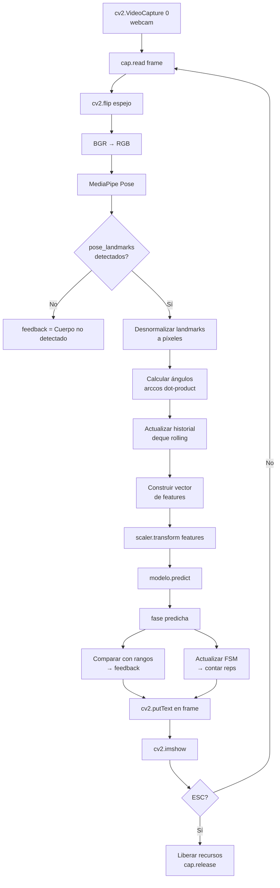

El historial (`deque` con `maxlen` fijo) actúa como ventana deslizante: al agregar un nuevo valor, el más antiguo se descarta automáticamente. Esto permite calcular estadísticas de ventana temporal sin acumular memoria.

### 5.2 Generación de feedback

**Wall Push-Up** — compara con rangos del `.npy`:

```python
rangos[fase_idx][articulacion] = {"min": ..., "max": ...}

# Con slack de ±5°
si angulo < min - slack  → "Codo muy bajo"
si angulo > max + slack  → "Codo muy alto"
sino                     → "Postura correcta"
```

**Dominada Neutro** — reglas sobre velocidad y aceleración por fase:

```python
si fase == 1 y vel < -15:        → "Controla la bajada"
si fase == 2 y |acc| < 50:       → "Movimiento muy lento"
si fase == 3 y vel > 10:         → "Sube controlando"
```

Adicionalmente, al cerrar una repetición:
```python
si ang_max_en_rep < 90°:   → "No subiste lo suficiente"    +7 penalización
si ang_min_en_rep > 150°:  → "No estiraste los brazos"     +7 penalización
score = max(0, 100 - penalización + randint(-5, 5))
```

**Dominada Abierto** — reglas por fase sobre ángulo del codo izquierdo:

```python
si fase == 3: "Extiende más los brazos" si ang < 150° sino "Buena extensión"
si fase == 2: "Movimiento controlado"
si fase == 1: "Sube más la barra"       si ang > 70°  sino "Buena contracción"
```

### 5.3 Conteo de repeticiones

#### Wall Push-Up — FSM de 3 estados

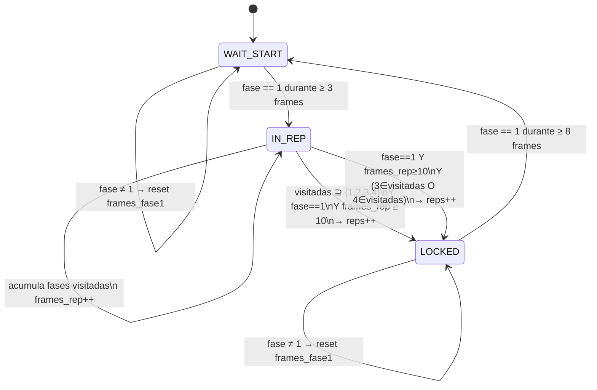

#### Dominada Neutro — apertura/cierre por fase

```python
si rep is None y fase == 1:
    rep = {"angulos": [], "mensajes": [], "penalizacion": 0}

si rep existe:
    rep["angulos"].append(ang)
    evaluar_fase(fase, vel, acc, rep)

    si len(rep["angulos"]) > 25 y fase == 1:
        # Cerrar repetición y calcular score
        reps.append(rep)
        rep_count += 1
        rep = None
```

#### Dominada Abierto — FSM de 4 estados

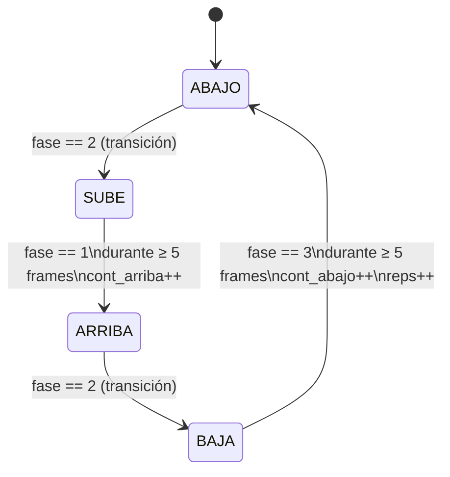

---

## 6. Pipeline de evaluación

Los scripts `Evaluacion_*.py` validan el modelo comparándolo contra un **Ground Truth algorítmico** (no anotaciones humanas) sobre un video de prueba.

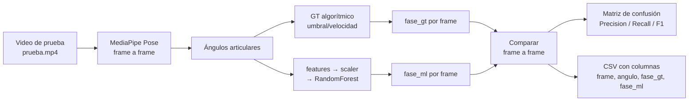

**Ground Truth usado en evaluación:**

- **Wall Push-Up:** GT híbrido basado en velocidad del codo (v_c < 0 → descenso, ≥ 0 → subida) + umbrales de posición relativa al rango máximo observado, con amplitudes empíricas por fase.

- **Dominada Neutro:** Misma función `fase_por_curva` usada en entrenamiento — umbral 20%/80% sobre ventana de 20 frames.

- **Dominada Abierto:** `fase_biomecanica` basada en ángulo normalizado al rango global del video (`ang_min`, `ang_max` pre-calculados) y umbral de velocidad:
  ```python
  si |vel| > 15°/s     → Fase 2 (movimiento)
  si ang_norm ≥ 0.75   → Fase 3 (arriba)
  si ang_norm ≤ 0.25   → Fase 1 (abajo)
  sino                 → Fase 2
  ```

> La evaluación mide si el modelo aprendió a replicar la lógica del GT algorítmico, **no** si predice correctamente desde un punto de vista biomecánico externo. La calidad depende de cuán bien el GT algorítmico describe la realidad.

---

## 7. Comparativa técnica por ejercicio

| Aspecto | Wall Push-Up | Dom. Agarre Neutro | Dom. Agarre Abierto |
|---------|-------------|---------------------|----------------------|
| **Archivo entrenamiento** | `Entrenamiento_wall_push_up.py` | `Entrenamiento_dominada_agarre_neutro.py` | `Entrenamiento_Dominada_Agarre_Abierto.py` |
| **Árbol de decisión** | RF 300 árboles | RF 400 árboles + balanceo | RF 400 árboles + balanceo |
| **Fases** | 4 | 3 | 3 |
| **Detección de reps** | Señal ponderada de ángulos | Flujo óptico vertical | Flujo óptico vertical |
| **Etiquetado fases** | Temporal fijo (proporciones de duración) | Umbral 20%/80% sobre ventana deslizante | Umbral relativo al máximo de la rep |
| **Nº features** | 3 (medias por fase) | 7 (ángulo + vel + acc + estadísticas) | 41 (estadísticas + derivadas temporales) |
| **Feature principal** | Ángulo medio de articulaciones | Ángulo codo derecho + dinámica | Ángulos bilaterales + apertura + tronco |
| **Balanceo de dataset** | No | Sobremuestreo bootstrap | No (class_weight="balanced") |
| **Suavizado de señal** | Filtro de Kalman | No | No |
| **Landmark principal** | lm[12,14,16] (codo derecho) | lm[12,14,16] (codo derecho) | lm[11–16, 23,24] (bilateral) |
| **Modelo faltante** | No | Sí — `modelo_fase_dominadas_rt.pkl` | No |
| **Vista cámara** | Lateral (perfil) | Frontal | Posterior |

---

## 8. Modelos ML — resumen

```mermaid
flowchart TD
    subgraph Wall_Push_Up
        A1[3 features\nCodo, Hombro, Espalda\nmedias por fase]
        A2[StandardScaler]
        A3[RF 300 árboles]
        A4[4 clases\nInicio/Descenso/Abajo/Subida]
        A1-->A2-->A3-->A4
    end

    subgraph Dominada_Neutro
        B1[7 features\nang + vel + acc\n+ estadísticas ventana]
        B2[Sobremuestreo bootstrap]
        B3[StandardScaler]
        B4[RF 400 árboles\nclass_weight=balanced]
        B5[3 clases\nAbajo/Movimiento/Arriba]
        B1-->B2-->B3-->B4-->B5
    end

    subgraph Dominada_Abierto
        C1[41 features\n5 ángulos × estadísticas\n+ velocidades/aceleraciones]
        C2[StandardScaler]
        C3[RF 400 árboles\nclass_weight=balanced]
        C4[3 clases\nArriba/Transición/Abajo]
        C1-->C2-->C3-->C4
    end
```

---

## 9. Estructura de archivos y artefactos

```
Correccion-de-Postura-en-tiempo-real/
│
├── Detección Automatica.py              ← Punto de entrada. Detecta ejercicio y lanza script.
│
├── Entrenamiento_wall_push_up.py        ← Genera Modelos/walls_push_up/
├── Entrenamiento_dominada_agarre_neutro.py
├── Entrenamiento_Dominada_Agarre_Abierto.py
│
├── Evaluacion_wall_push_up.py           ← Valida GT vs ML. Requiere videos/*/prueba.mp4
├── Evaluacion_dominada_agarre_neutro.py
├── Evaluacion_dominada_agarre_abierto.py
│
├── Retroalimentación_Wall__push_up.py   ← Inferencia en tiempo real. Carga Modelos/walls_push_up/
├── Retroalimentacion_dominada_agarre_neutro.py
├── Retroalimentación_Dominada_Agarre_Abierto.py
│
├── Modelos/
│   ├── walls_push_up/
│   │   ├── modelo_fase.pkl              ← RF entrenado (300 árboles, 3 features, 4 clases)
│   │   ├── scaler_fase.pkl              ← StandardScaler ajustado en entrenamiento
│   │   └── rangos_por_fase.npy          ← Dict {fase: {articulacion: {min, max, mean}}}
│   │
│   ├── dominadas neutro/
│   │   ├── modelo_fase_dominadas_rt.pkl ← FALTANTE — bloquea ejecución
│   │   ├── scaler_fase_dominadas_rt.pkl ← Presente
│   │   └── rangos_por_fase.npy          ← Presente (no usado en retroalimentación)
│   │
│   └── dominadas agarre abierto/
│       ├── modelo_fases.pkl             ← RF entrenado (400 árboles, 41 features, 3 clases)
│       ├── scaler_fases.pkl             ← StandardScaler ajustado en entrenamiento
│       └── dataset_fases.csv            ← Dataset de entrenamiento serializado
│
├── requirements.txt
└── videos/                              ← NO en repo. Requerido para entrenamiento/evaluación.
    ├── wall_push_up/
    ├── dominadas_neutro/
    └── dominadas_abierto/
```

**Dependencias Python:**

```
opencv-python   — captura de video, procesamiento de imagen, flujo óptico
mediapipe       — detección de pose (BlazePose)
numpy           — álgebra vectorial, operaciones sobre arrays
pandas          — manipulación de DataFrames, rolling mean
scipy           — find_peaks para detección de repeticiones
pykalman        — filtro de Kalman para suavizado (Wall Push-Up)
scikit-learn    — RandomForestClassifier, StandardScaler, métricas
joblib          — serialización de modelos (.pkl)
```

---

## 10. Limitaciones conocidas

### Bugs activos

| Bug | Archivo | Línea | Impacto |
|-----|---------|-------|---------|
| `import os` faltante | `Detección Automatica.py` | 15 | NameError al arrancar |
| `acc_ang` idéntica a `vel_ang` | `Retroalimentacion_dominada_agarre_neutro.py` | 41–43 | Aceleración = velocidad; feature incorrecta |
| Ángulo espalda siempre 0° | `Retroalimentación_Wall__push_up.py` | 200 | Feature inútil en predicción |

### Modelo faltante

`Modelos/dominadas neutro/modelo_fase_dominadas_rt.pkl` no existe en el repositorio. `Retroalimentacion_dominada_agarre_neutro.py` llama a `joblib.load()` a nivel de módulo (línea 17), por lo que falla inmediatamente al ser importado o ejecutado.

### Diseño de Ground Truth

El etiquetado de fases de entrenamiento no usa anotaciones biomecánicas externas ni un especialista. Se basa en heurísticas geométricas y temporales. Esto implica:

- El modelo aprende a replicar la heurística, no la biomecánica real.
- Si los videos de entrenamiento tienen ejecuciones atípicas, los rangos capturados serán incorrectos.
- El método de la Wall Push-Up (segmentación temporal fija) es el más frágil: una repetición lenta o rápida recibe las mismas proporciones de fase que una a velocidad normal.

### Dependencia de cámara

Todos los scripts de retroalimentación y evaluación asumen `cv2.VideoCapture(0)` disponible. En entornos sin cámara (servidores, CI/CD) fallan sin manejo de error específico más allá del `print("Cámara no disponible")`.

### Invarianza de escala espacial

Los ángulos articulares son invariantes a la distancia del usuario a la cámara. Sin embargo, la feature `grip` (distancia euclidiana en píxeles entre muñecas) en Dominada Abierto **sí depende de la distancia a la cámara**. Un usuario más lejos producirá un `grip` menor para el mismo agarre real.
