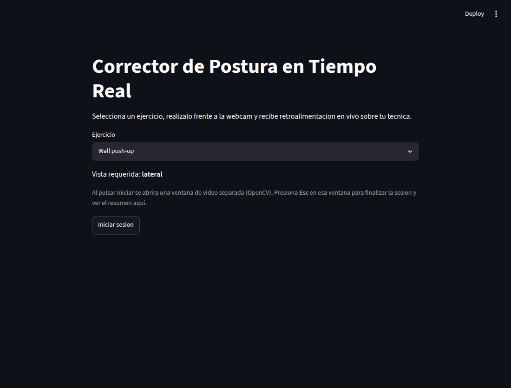

# Correccion de Postura en Tiempo Real

Sistema de analisis de ejercicios de fuerza mediante vision por computadora y aprendizaje automatico. Usa MediaPipe Pose para extraer landmarks corporales y modelos Random Forest para clasificar fases de movimiento en tiempo real.



> Interfaz del MVP (Streamlit): se elige el ejercicio y se inicia la sesion. La retroalimentacion en vivo (esqueleto, fase, contador de reps y mensajes de tecnica) se muestra en una ventana de OpenCV aparte, no en el navegador.

## Ejercicios soportados

| Ejercicio | Script en tiempo real | Fases |
|-----------|------------------------|-------|
| Wall push-up | `retroalimentacion_wall_pushup.py` | Inicio, descenso, abajo, subida |
| Dominada con agarre abierto | `retroalimentacion_dominada_abierta.py` | Arriba, transicion, abajo |

## Flujo del proyecto

```text
videos de referencia
    -> scripts de entrenamiento
    -> artefactos en modelos/
    -> scripts de retroalimentacion
    -> scripts de evaluacion
```

El punto de entrada general es `deteccion_automatica.py`, que detecta la postura inicial con la camara y lanza el script de retroalimentacion correspondiente. Si detecta un ejercicio cuyo modelo falta, muestra que no esta disponible en vez de lanzar un script que fallaria.

## Estructura principal

```text
.
├── deteccion_automatica.py
├── entrenamiento_*.py
├── evaluacion_*.py
├── retroalimentacion_*.py
├── core/              # lógica compartida (geometría, pose, señales, features)
├── modelos/
├── docs/
├── requirements.txt
└── CLAUDE.md
```

## Documentacion

- [Indice de documentacion](docs/README.md)
- [Documentacion tecnica](docs/DOCUMENTACION_TECNICA.md)
- [Estado del proyecto](docs/ESTADO_PROYECTO.md)
- [Notas para asistentes de desarrollo](CLAUDE.md)

## Instalacion

**Atajo (recomendado).** Scripts de inicializacion rapida que crean el entorno e instalan dependencias:

```bash
./init.sh            # Linux / macOS (o Git Bash / WSL en Windows)
./init.sh --docker   # ademas levanta la base de datos (PostgreSQL + PostgREST)
```

```bat
init.bat             :: Windows (cmd.exe)
init.bat --docker    :: ademas levanta la base de datos
```

**Manual.** Equivale a lo que hacen los scripts:

```bash
/usr/bin/python3.11 -m venv .venv
source .venv/bin/activate
python -m pip install --upgrade pip setuptools wheel
python -m pip install -r requirements.txt
```

Se usa Python 3.11 porque `mediapipe==0.10.14` no es compatible de forma confiable con Python 3.13. El `requirements.txt` tambien fija `scikit-learn==1.6.1`, que coincide con la version usada para serializar los modelos `.pkl` versionados.

## Ejecucion rapida

```bash
source .venv/bin/activate
streamlit run app.py
```

La app lista los ejercicios disponibles. Elige uno, pulsa **Iniciar** y la ventana de retroalimentacion en vivo (OpenCV) se abre. Realiza el ejercicio frente a la camara y cierra con `Esc`. Al terminar, la app muestra la tarjeta de resumen con reps totales, porcentaje de postura correcta y errores principales por episodios, duracion aproximada y porcentaje de tiempo evaluado.

Ejercicios disponibles en el MVP:
- **Wall push-up** (vista lateral) — modelo en `modelos/wall_pushup/`.
- **Dominada agarre abierto** (vista posterior) — modelo en `modelos/dominada_abierta/`.

La dominada con agarre neutro quedo fuera de la interfaz porque falta su modelo `modelos/dominada_neutra/modelo_fase_dominadas_rt.pkl`. Sus scripts y el scaler se conservan para reentrenar a futuro.

## Persistencia opcional (PostgreSQL + PostgREST en Docker)

Cada sesion se guarda siempre como JSON en `sesiones/`. Ademas, de forma **opcional**, el resumen puede enviarse a una base de datos PostgreSQL expuesta por PostgREST, todo contenerizado. Es *best-effort*: si la base no esta levantada, la sesion de ejercicio funciona igual (el envio se omite sin error).

### Requisitos

- Docker y Docker Compose v2 (`docker compose version`).

### Quick start

```bash
# 1) (opcional) personalizar credenciales/puertos
cp .env.example .env

# 2) levantar la base de datos y la API
docker compose up -d db postgrest

# 3) verificar que responde (catalogo sembrado)
curl -s http://localhost:3000/ejercicio
```

Esto levanta:

| Servicio | Puerto host | Para que |
|----------|-------------|----------|
| `postgrest` | `3000` | API REST (lectura y escritura). La app escribe aqui. |
| `db` (Postgres) | `5433` | Inspeccion directa con `psql` (configurable con `DB_PORT`). |
| `swagger` (opcional) | `8080` | UI para explorar la API: `docker compose up -d swagger`. |

> El puerto host de la base es `5433` por defecto para no chocar con un Postgres local en `5432`. PostgREST no usa el puerto del host: conecta por la red interna de Docker (`db:5432`).

### Como escribe la app

Al cerrar una sesion, los scripts de retroalimentacion llaman a `core/db.py`, que hace `POST /rpc/crear_sesion` (inserta usuario + sesion + errores en una sola transaccion). Variables de entorno opcionales:

- `TT1_DB_URL` — URL de PostgREST (por defecto `http://localhost:3000`).
- `TT1_USUARIO` — nombre del usuario asociado a la sesion (por defecto `demo`).

### Consultar y apagar

```bash
# sesiones guardadas, con sus errores principales anidados
curl -s "http://localhost:3000/sesion?select=*,sesion_error(*)"

docker compose down      # detiene y borra los contenedores (conserva los datos)
docker compose down -v   # ademas borra el volumen (reinicia la base desde cero)
```

El esquema y los modelos de datos (tablas `usuario`, `ejercicio`, `sesion`, `sesion_error`, roles y la RPC `crear_sesion`) son la fuente de verdad en `db/01_init.sql`. El diseno, las decisiones y la operacion estan documentados en [docs/PERSISTENCIA.md](docs/PERSISTENCIA.md).

## Solucion de problemas

| Sintoma | Causa probable | Que hacer |
|---------|----------------|-----------|
| `pip install` falla en `mediapipe` | El interprete no es Python 3.11 | `mediapipe==0.10.14` no tiene wheel confiable para 3.12/3.13. Crea el venv con 3.11: `PYTHON=/usr/bin/python3.11 ./init.sh`. |
| La camara no abre o se ve en negro | Otra app la tiene ocupada, o el indice no es 0 | Cierra Zoom/Meet/navegador que use la webcam. Si tienes varias camaras, prueba con otro indice (`cv2.VideoCapture(1)`) o revisa permisos del sistema. |
| Pulso "Iniciar" y no veo video en el navegador | Es lo esperado | El video en vivo se abre en una **ventana de OpenCV separada** (no en Streamlit). Traela al frente; cierra con `Esc`. |
| Un ejercicio aparece como "no disponible" | Falta su `.pkl` en `modelos/` | Solo wall push-up y dominada abierta tienen modelo. La dominada neutra requiere reentrenar (`modelo_fase_dominadas_rt.pkl`). |
| `streamlit run app.py`: "Port 8501 is not available" | Ya hay otra app en 8501 | Usa otro puerto: `streamlit run app.py --server.port 8502`. |
| `[db] no se pudo enviar la sesion a PostgREST` | La base de datos no esta levantada | Es **best-effort**: la sesion funciona igual y el JSON local se guarda. Para persistir: `docker compose up -d db postgrest`. |
| `docker compose up` falla por el puerto 5433 o 3000 | Otro servicio usa esos puertos | Cambia el puerto host de la DB con `DB_PORT=5434 docker compose up -d db postgrest`; el 3000 (PostgREST) se ajusta en `docker-compose.yml`. |
| No se genera `sesiones/<...>.json` | Cerraste antes de completar una repeticion | El resumen se escribe al salir con `Esc` tras al menos una rep contada por el FSM. |

## Estado actual

El proyecto tiene modelos versionados para wall push-up y dominada con agarre abierto. La dominada con agarre neutro quedo fuera de la interfaz (catalogo y deteccion automatica) porque falta `modelos/dominada_neutra/modelo_fase_dominadas_rt.pkl`; sus scripts y scaler siguen versionados por si se reentrena.
