# Documentación Técnica — Corrección de Postura en Tiempo Real

## Índice

1. [Objetivo del sistema](#1-objetivo-del-sistema)
2. [Arquitectura general](#2-arquitectura-general)
3. [Interfaz Streamlit (MVP)](#3-interfaz-streamlit-mvp)
4. [Detección automática de ejercicio](#4-detección-automática-de-ejercicio)
5. [Pipeline de entrenamiento](#5-pipeline-de-entrenamiento)
   - 4.1 [Extracción de landmarks (MediaPipe)](#41-extracción-de-landmarks-mediapipe)
   - 4.2 [Cálculo de ángulos articulares](#42-cálculo-de-ángulos-articulares)
   - 4.3 [Detección de repeticiones](#43-detección-de-repeticiones)
   - 4.4 [Etiquetado de fases](#44-etiquetado-de-fases)
   - 4.5 [Construcción del vector de features](#45-construcción-del-vector-de-features)
   - 4.6 [Entrenamiento del clasificador](#46-entrenamiento-del-clasificador)
5. [Pipeline de inferencia en tiempo real](#5-pipeline-de-inferencia-en-tiempo-real)
   - 5.1 [Loop de predicción](#51-loop-de-predicción)
   - 5.2 [Generación de feedback](#52-generación-de-feedback)
   - 5.3 [Conteo de repeticiones](#53-conteo-de-repeticiones)
6. [Pipeline de evaluación](#6-pipeline-de-evaluación)
7. [Comparativa técnica por ejercicio](#7-comparativa-técnica-por-ejercicio)
8. [Modelos ML — resumen](#8-modelos-ml--resumen)
9. [Estructura de archivos y artefactos](#9-estructura-de-archivos-y-artefactos)
10. [Limitaciones conocidas](#10-limitaciones-conocidas)

---

## 1. Objetivo del sistema

El sistema clasifica en tiempo real la **fase biomecánica** de tres ejercicios de fuerza de tronco superior:

| Ejercicio | Fases | Vista cámara |
|-----------|-------|--------------|
| Wall Push-Up | 4 (inicio, descenso, abajo, subida) | Lateral |
| Dominada agarre neutro | 3 (abajo, movimiento, arriba) | Frontal |
| Dominada agarre abierto | 3 (arriba, transición, abajo) | Posterior |

Con la fase predicha, el sistema:
- Emite mensajes de corrección en pantalla si los ángulos articulares están fuera de rango
- Cuenta repeticiones mediante máquinas de estados
- Graba el video de la sesión (Wall Push-Up y Dominada Neutro)

El conocimiento de "postura correcta" proviene exclusivamente de los videos de entrenamiento grabados por el usuario. No existe un criterio biomecánico externo hardcodeado: los rangos válidos son los observados en esos videos de referencia.

---

## 2. Arquitectura general

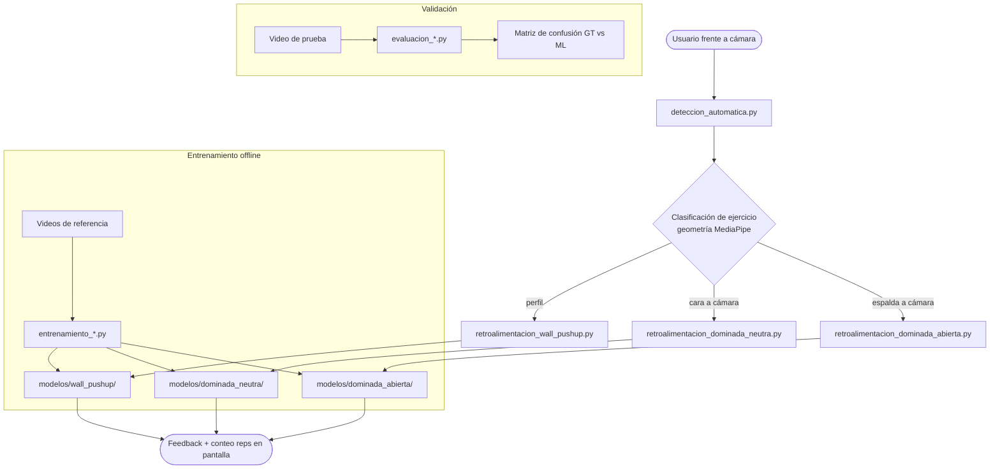

---

## 3. Interfaz Streamlit (MVP)

**Archivo:** `app.py` (raiz del repositorio). Punto de entrada: `streamlit run app.py`.

### Flujo de uso

```
app.py
  └─ selectbox de ejercicios (core/catalogo.disponibles())
       └─ boton "Iniciar"
            └─ subprocess.run([sys.executable, script_del_ejercicio])
                 └─ retroalimentacion_*.py   (ventana OpenCV en vivo)
                      └─ core/reps.py        (FSM conteo de reps)
                      └─ core/sesion.acumular(fase, correcto, errores)  por frame
                      └─ core/sesion.guardar(resumen, ejercicio)  al salir (Esc)
                           └─ sesiones/<ejercicio>_<timestamp>.json
  └─ tarjeta de resumen
       └─ core/sesion.cargar_ultima(ejercicio)
```

### Modulos nuevos en core/

| Modulo | Funcion principal |
|--------|-------------------|
| `core/catalogo.py` | `EJERCICIOS` (dict con metadatos por ejercicio), `disponible(id)`, `disponibles()` |
| `core/reps.py` | `FsmWallPushup` (WAIT_START/IN_REP/LOCKED), `FsmDominadaAbierta` (ABAJO/SUBE/ARRIBA/BAJA) |
| `core/sesion.py` | `acumular(log, fase, correcto, errores)`, `resumen(log, reps, duracion_seg)`, `guardar(resumen, ejercicio)`, `cargar_ultima(ejercicio)` |

### Metricas del resumen (core/sesion.resumen)

- **reps**: contadas por la FSM del ejercicio.
- **frames_evaluados**: frames con `correcto is not None` (fase != -1).
- **frames_correctos**: frames con `correcto is True`.
- **pct_correcto**: `100 * frames_correctos / frames_evaluados` (0.0 si no hay evaluados).
- **top_errores**: compatibilidad con sesiones anteriores; conteo bruto por frame como `[[mensaje, conteo], ...]`.
- **errores_principales**: los errores principales agrupados por episodios consecutivos de al menos 3 frames. Cada entrada incluye `mensaje`, `eventos`, `frames`, `segundos` aproximados y `pct_tiempo_evaluado`.
- **frames_con_error / pct_frames_con_error**: frames evaluados con al menos un error y su porcentaje sobre `frames_evaluados`.
- **duracion_seg**: tiempo de pared de la sesion.

### Ejercicios disponibles en el MVP

Solo los dos con modelo entrenado y versionado: wall push-up y dominada agarre abierto. La dominada neutra aparece en la lista como no disponible porque falta `modelos/dominada_neutra/modelo_fase_dominadas_rt.pkl`.

---

## 4. Detección automática de ejercicio

**Archivo:** `deteccion_automatica.py`

### Lógica geométrica

MediaPipe retorna landmarks normalizados en [0,1]. Se usan tres puntos:

- `lm[0]` — nariz
- `lm[11]` — hombro izquierdo
- `lm[12]` — hombro derecho

```python
ancho_hombros  = |sho_l.x - sho_r.x| * w
centro_hombros = (sho_l + sho_r) / 2

# Regla 1: perfil → push-up
si |nariz.x - centro.x| > ancho * 0.35:
    ejercicio = "pushup"

# Regla 2: cara a cámara → dominada neutra
elif nariz.y < centro.y:
    ejercicio = "dom_neutra"

# Regla 3: espalda a cámara → dominada abierta
else:
    ejercicio = "dom_abierta"
```

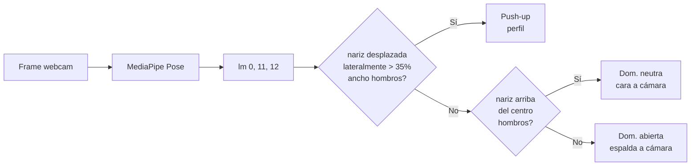

### Mecanismo de estabilización

Para evitar lanzar el script por una detección espuria, se exige **1 segundo de posición estable**:

```python
UMBRAL_MOV   = 8 px      # desplazamiento máximo permitido del hombro derecho
FPS_EST      = 25
TIEMPO_ESTABLE = 1.0 s   # = 25 frames consecutivos estables
```

Si el hombro derecho se desplaza más de 8px entre frames consecutivos, el contador de estabilidad se reinicia. Al alcanzar 1 segundo estable, muestra un countdown 3-2-1 y lanza el script con:

```python
subprocess.call([sys.executable, SCRIPTS[ejercicio]])
```

Antes del countdown se valida que existan el script y el modelo requeridos para el ejercicio detectado. Si, por ejemplo, se detecta dominada neutra y falta `modelos/dominada_neutra/modelo_fase_dominadas_rt.pkl`, el detector muestra `dom_neutra no disponible: falta modelo` y no lanza el subprocess.

---

## 4. Pipeline de entrenamiento

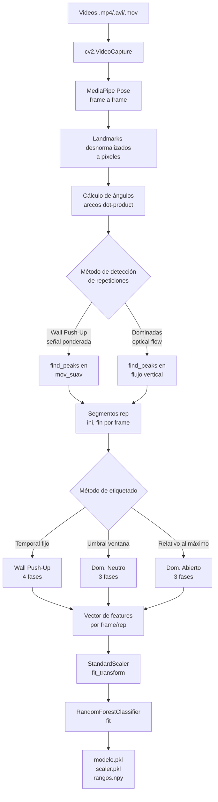

### 4.1 Extracción de landmarks (MediaPipe)

MediaPipe Pose (BlazePose) detecta 33 landmarks del cuerpo humano. Retorna coordenadas normalizadas `(x, y, z, visibility)` en rango [0,1]. El sistema solo usa las coordenadas 2D `(x, y)` desnormalizadas a píxeles:

```python
punto = [landmark.x * ancho_frame, landmark.y * alto_frame]
```

Los landmarks relevantes por índice:

```
 0 — nariz
11 — hombro izq     12 — hombro der
13 — codo izq       14 — codo der
15 — muñeca izq     16 — muñeca der
23 — cadera izq     24 — cadera der
```

#### Detalle técnico del modelo subyacente

> **Importante:** MediaPipe **no se entrena en este proyecto**. Es un modelo pre-entrenado por Google que se consume como caja negra. Lo único que se entrena en este repositorio es el `RandomForestClassifier` que opera *sobre* los ángulos derivados de estos landmarks (ver §4.6). La separación de responsabilidades es:
>
> - **MediaPipe (Google):** imagen RGB → 33 keypoints. Visión por computadora "difícil", ya resuelta.
> - **Random Forest (este repo):** ángulos → fase del ejercicio. Clasificación "fácil" sobre datos limpios.

**Modelo:** BlazePose (variante reciente **BlazePose GHUM**), expuesto vía la API *legacy* `mp.solutions.pose`. Es un **pipeline de dos etapas**:

1. **Detector de persona** (corre 1 vez, o al perder el tracking): SSD ligero derivado de BlazeFace. Localiza la ROI del torso usando la **cara como ancla** (asume cabeza visible). Predice centro, escala y rotación.
2. **Tracker de landmarks** (corre cada frame): CNN **encoder-decoder con skip-connections** (estilo U-Net) que regresa los 33 keypoints sobre la ROI recortada. Mientras mantenga confianza, **omite el detector** y reusa la ROI previa → de ahí su velocidad y estabilidad.

**Arquitectura de la red de landmarks:**

- Entrena con un enfoque combinado **heatmap + offset + regresión**: la rama de heatmap supervisa un *embedding* ligero que alimenta a la rama de regresión de coordenadas.
- **En inferencia las capas de heatmap se eliminan**; solo queda la regresión → modelo más liviano.
- Incluye un **clasificador de visibilidad por punto** (el campo `landmark.visibility`).
- La coordenada `z` y los *world landmarks* en metros provienen del modelo estadístico 3D **GHUM**.

**Entrada / salida:**

- Entrada: imagen RGB redimensionada internamente a **256×256** (Lite/Full) o 512×512 (Heavy).
- Salida: 33 keypoints × `(x, y, z, visibility, presence)` = **165 valores**. La topología de 33 puntos combina BlazeFace + BlazePalm + COCO (más puntos que el COCO estándar de 17, útil para fitness).

**Variantes y costo (paper arXiv 2006.10204, Pixel 2, 1 core CPU):**

| Variante | `model_complexity` | Parámetros | Cómputo | Velocidad | PCK@0.2 | Latencia CPU/GPU |
|----------|--------------------|------------|---------|-----------|---------|------------------|
| Lite | 0 | 1.3 M | 2.7 MFLOPs | ~310 FPS | 79.6 % | ~15 / ~5 ms |
| **Full** ← usado aquí | **1** (por defecto) | **3.5 M** | **6.9 MFLOPs** | ~102 FPS | 84.1 % | ~30 / ~8 ms |
| Heavy | 2 | red más profunda | — | — | mayor | 80+ / ~15-20 ms |

Tamaño de los archivos `.tflite` (reporte Qualcomm/Dataloop): detector de pose ~3.14 MB, detector de landmarks ~12.9 MB.

**Configuración efectiva en este proyecto:**

Todos los scripts instancian `mp_pose.Pose(min_detection_confidence=0.6, min_tracking_confidence=0.6)`. Como **no especifican `model_complexity`, usan el valor por defecto `1` (Full)** y `smooth_landmarks=True` (suavizado temporal del jitter, relevante porque luego se derivan velocidad/aceleración de los ángulos).

**Versión:** `requirements.txt` fija `mediapipe==0.10.14` para garantizar la disponibilidad de la API `mp.solutions.pose`. Las versiones nuevas de MediaPipe empujan la *Tasks API* (`PoseLandmarker`) y van retirando el espacio `solutions.*` que este código usa; **no actualizar sin migrar la API primero**. El entorno reproducible se crea con Python 3.11.

**Referencias:**
- BlazePose: On-device Real-time Body Pose tracking — arXiv [2006.10204](https://arxiv.org/abs/2006.10204)
- BlazePose GHUM Holistic — arXiv [2206.11678](https://arxiv.org/abs/2206.11678)
- Blog Google Research — [On-device Real-time Body Pose Tracking with MediaPipe BlazePose](https://research.google/blog/on-device-real-time-body-pose-tracking-with-mediapipe-blazepose/)
- Doc oficial MediaPipe Pose (`model_complexity`, defaults) — [github.com/google-ai-edge/mediapipe](https://github.com/google-ai-edge/mediapipe/blob/master/docs/solutions/pose.md)

### 4.2 Cálculo de ángulos articulares

Función común a todos los scripts:

```python
def calcular_angulo(a, b, c):
    ba = a - b      # vector del punto b al punto a
    bc = c - b      # vector del punto b al punto c
    coseno = dot(ba, bc) / (|ba| * |bc|)
    return degrees(arccos(clip(coseno, -1, 1)))
```

Retorna el ángulo **en el vértice `b`** entre los segmentos `b→a` y `b→c`, en grados [0°, 180°]. El `clip` evita errores numéricos por valores fuera del dominio de arccos.

```
        a
       /
      / ← ángulo θ en b
     b ————— c
```

**Ángulos calculados por ejercicio:**

```
Wall Push-Up:
  codo    = ángulo(hombro, codo, muñeca)         lm[12,14,16] lado derecho
  hombro  = ángulo(codo, hombro, cadera)         lm[14,12,24]
  espalda = ángulo(hombro, cadera, [cadera_x, 0]) ← inclinación del tronco vs. vertical
                                                  (antes (hombro,cadera,cadera) → 0°; corregido)

Dominada Neutro:
  codo_der = ángulo(hombro_der, codo_der, muñeca_der)   lm[12,14,16]

Dominada Abierto:
  codo_izq  = ángulo(hombro_izq, codo_izq, muñeca_izq)  lm[11,13,15]
  codo_der  = ángulo(hombro_der, codo_der, muñeca_der)  lm[12,14,16]
  apertura  = ángulo(codo_izq, hombro_izq, codo_der)    lm[13,11,14]  ← apertura hombros
  tronco    = ángulo(mid_cadera, mid_hombro, [mid_sho.x, 0])  ← inclinación vertical
  agarre    = distancia euclidiana(muñeca_izq, muñeca_der)    ← no es ángulo
```

### 4.3 Detección de repeticiones

#### Wall Push-Up — señal de movimiento ponderada

```python
# Normalización por columna al rango [0,1]
codo_norm   = (codo   - min) / (max - min)
hombro_norm = (hombro - min) / (max - min)
espalda_norm = (espalda - min) / (max - min)

# Señal escalar combinada (pesos empíricos)
mov = codo_norm * 0.6 + hombro_norm * 0.3 + espalda_norm * 0.1

# Suavizado con ventana deslizante de 9 frames
mov_suav = rolling_mean(mov, window=9)

# Detección de ciclos
picos,  _ = find_peaks( mov_suav, distance=15, prominence=0.02)
valles, _ = find_peaks(-mov_suav, distance=15, prominence=0.02)

# Cada rep = (pico_anterior_al_valle, valle)
```

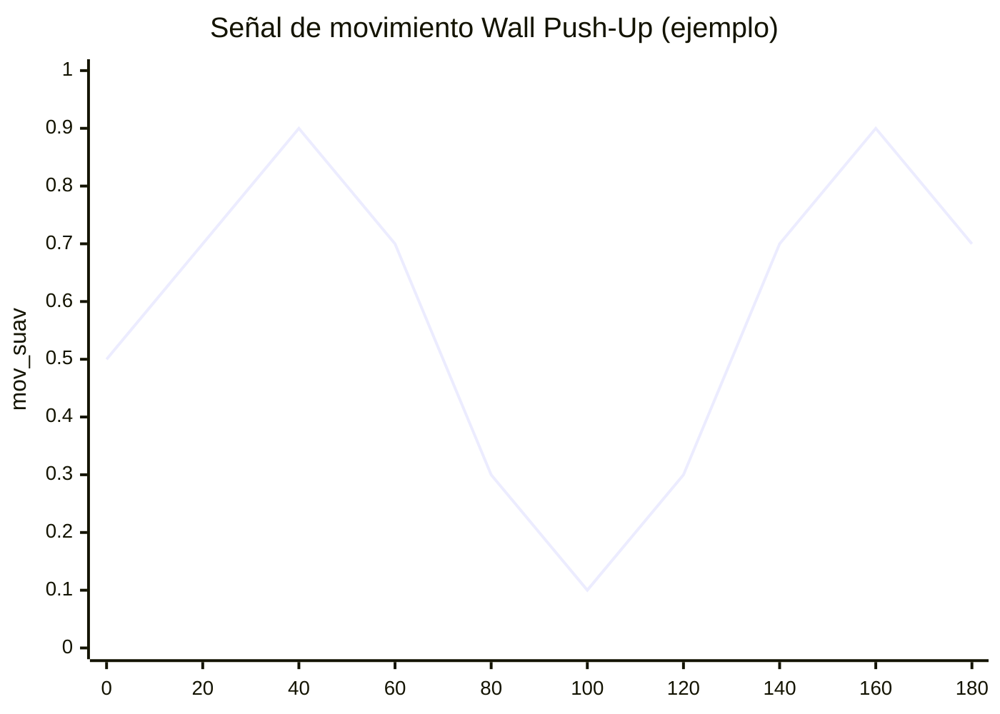

#### Dominada Neutro / Abierto — flujo óptico de Farneback

```python
flow = cv2.calcOpticalFlowFarneback(
    prev_gray, gray, None,
    pyr_scale=0.5, levels=3, winsize=15,
    iterations=3, poly_n=5, poly_sigma=1.2, flags=0
)
# Se promedia la componente Y (movimiento vertical)
mov_vertical = mean(flow[..., 1])
```

El flujo óptico de Farneback estima el campo de velocidades de cada píxel entre frames consecutivos. Al promediar la componente Y sobre toda la imagen, se obtiene una señal escalar que sube cuando el cuerpo sube y baja cuando el cuerpo baja. Los picos y valles de esta señal delimitan las repeticiones.

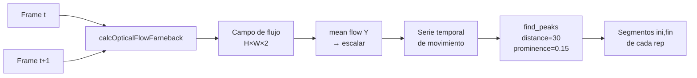

### 4.4 Etiquetado de fases

Este paso asigna una etiqueta de fase (ground truth para el entrenamiento) a cada frame dentro de un segmento de repetición. Es el paso más crítico porque define qué aprende el modelo.

#### Wall Push-Up — segmentación temporal fija

```python
length = fin - ini + 1
b2 = int(0.25 * length)   # 25% → fin fase 1
b3 = int(0.45 * length)   # 45% → fin fase 2
b4 = int(0.70 * length)   # 70% → fin fase 3

para cada frame en [ini, fin]:
    si posición_relativa ≤ b2  → Fase 1 (inicio / posición alta)
    si posición_relativa ≤ b3  → Fase 2 (descenso)
    si posición_relativa ≤ b4  → Fase 3 (posición baja)
    si posición_relativa > b4  → Fase 4 (subida)
```

> La asignación es **puramente temporal**. Los frames del 25% al 45% se etiquetan como "descenso" independientemente de si el ángulo realmente está bajando.

```
Rep:  |——Fase1——|——Fase2——|——Fase3——|————Fase4————|
      0%       25%       45%       70%           100%
```

#### Dominada Neutro — umbral sobre ventana deslizante

```python
# Ventana deslizante de los últimos 25 ángulos de codo
ang = array(ventana)
amp = max(ang) - min(ang)

si ang[-1] ≤ min + 0.20 * amp  → Fase 1 (abajo, brazos extendidos)
si ang[-1] ≥ max - 0.20 * amp  → Fase 3 (arriba, máxima contracción)
sino                            → Fase 2 (movimiento)
```

Las fases 1 y 3 se asignan solo cuando el ángulo está en el 20% inferior o superior de la amplitud registrada en la ventana. El 60% del rango central es siempre "movimiento".

#### Dominada Abierto — umbral relativo al máximo de la repetición

```python
# Se calcula el ángulo máximo alcanzado en toda la repetición
ang_max = max(angulos_en_rep)

si ang ≥ 0.75 * ang_max  → Fase 1 (arriba)
si ang ≥ 0.45 * ang_max  → Fase 2 (transición)
si ang <  0.45 * ang_max → Fase 3 (abajo)
```

### 4.5 Construcción del vector de features

#### Wall Push-Up — 3 features (agregados por fase)

```
X = [Codo_mean, Hombro_mean, Espalda_mean]
```

En lugar de features por frame, se calcula la **media de cada ángulo en el segmento de la fase**. El modelo recibe una fila por fase por repetición.

El scaler versionado conserva esos nombres de columnas; por eso la retroalimentación y la evaluación construyen un `DataFrame` con `Codo_mean`, `Hombro_mean`, `Espalda_mean` antes de llamar a `scaler.transform`.

#### Dominada Neutro — 7 features por frame

```
X = [
    ang,           # ángulo codo derecho frame actual
    vel,           # (ang[t] - ang[t-1]) * fps   → vel. angular °/s
    acc,           # aceleración: misma diferencia finita aplicada a vel_hist
    ang_mean,      # media de ventana de 25 frames de ángulo
    ang_min,       # mínimo de ventana de 25 frames
    ang_max,       # máximo de ventana de 25 frames
    vel_mean,      # media de ventana de 5 frames de velocidad
]
```

La intención es capturar no solo la posición angular sino la **dinámica temporal**: si el ángulo está subiendo/bajando rápido, en qué zona del rango de movimiento se encuentra.

> El orden anterior es contractual: entrenamiento, retroalimentación y evaluación
> usan exactamente `ang, vel, acc, ang_mean, ang_min, ang_max, vel_mean`.

#### Dominada Abierto — 41 features por frame

Para 5 señales base (`ang_l`, `ang_r`, `ang_h`, `grip`, `trunk`), se calculan 5 estadísticas de una ventana de 25 frames:

```
[last, mean, min, max, std]  × 5 señales = 25 features
```

Para 4 señales (`ang_l`, `ang_r`, `ang_h`, `hip_y`), se calculan velocidad y aceleración con sus medias:

```
vel[k]      = (hist[k][-1] - hist[k][-2]) * fps
acc[k]      = (vel_hist[k][-1] - vel_hist[k][-2]) * fps
features    = [vel_last, vel_mean, acc_last, acc_mean]  × 4 = 16 features
```

Total: **25 + 16 = 41 features**

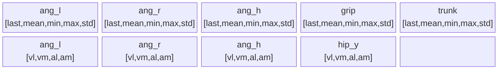

*25 estadísticas posicionales + 16 estadísticas dinámicas = 41 features*

### 4.6 Entrenamiento del clasificador

```python
# Normalización: media=0, desviación=1 por feature
scaler = StandardScaler()
X_scaled = scaler.fit_transform(X)

# Clasificador
modelo = RandomForestClassifier(
    n_estimators = 300 / 400,   # árboles
    random_state = 42,
    n_jobs       = -1,           # paralelismo
    class_weight = "balanced"   # dominadas
)
modelo.fit(X_scaled, y)
```

El `StandardScaler` se conserva como parte del pipeline entrenado y debe aplicarse
en inferencia con el mismo orden de features. Los features tienen escalas muy
distintas:
- Ángulos: [0°, 180°]
- Velocidades angulares: [-1000, 1000] °/s aprox.
- Distancia de agarre (grip): [0, ancho_frame] píxeles

En Random Forest el escalado no es estrictamente necesario para que el árbol
pueda dividir por umbrales; aun así, si el modelo fue entrenado con datos
escalados, la misma transformación es obligatoria al predecir.

**Balanceo de clases (Dominada Neutro):**

```python
# Sobremuestreo por bootstrap al tamaño de la clase mayoritaria
max_count = max(count per clase)
para cada clase c:
    idx = random_choice(len(Xc), size=max_count, replace=True)
    Xc_balanced = Xc[idx]
```

**Artefactos guardados:**

| Archivo | Descripción |
|---------|-------------|
| `modelo_*.pkl` | RandomForestClassifier serializado con joblib |
| `scaler_*.pkl` | StandardScaler serializado — debe usarse con el mismo orden de features |
| `rangos_por_fase.npy` | Dict `{fase: {ángulo: {min, max, mean}}}` para feedback |
| `dataset_*.csv` | Datos de entrenamiento (para inspección) |

---

## 5. Pipeline de inferencia en tiempo real

### 5.1 Loop de predicción

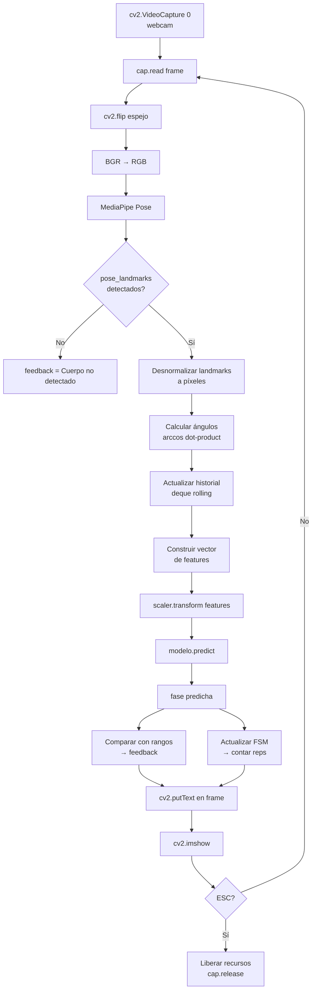

El historial (`deque` con `maxlen` fijo) actúa como ventana deslizante: al agregar un nuevo valor, el más antiguo se descarta automáticamente. Esto permite calcular estadísticas de ventana temporal sin acumular memoria.

### 5.2 Generación de feedback

**Wall Push-Up** — compara con rangos del `.npy`:

```python
rangos[fase_idx][articulacion] = {"min": ..., "max": ...}

# Con slack de ±5°
si angulo < min - slack  → "Codo muy bajo"
si angulo > max + slack  → "Codo muy alto"
sino                     → "Postura correcta"
```

**Dominada Neutro** — reglas sobre velocidad y aceleración por fase:

```python
si fase == 1 y vel < -15:        → "Controla la bajada"
si fase == 2 y |acc| < 50:       → "Movimiento muy lento"
si fase == 3 y vel > 10:         → "Sube controlando"
```

Adicionalmente, al cerrar una repetición:
```python
si ang_max_en_rep < 90°:   → "No subiste lo suficiente"    +7 penalización
si ang_min_en_rep > 150°:  → "No estiraste los brazos"     +7 penalización
score = max(0, 100 - penalización + randint(-5, 5))
```

**Dominada Abierto** — reglas por fase sobre ángulo del codo izquierdo:

```python
si fase == 3: "Extiende más los brazos" si ang < 150° sino "Buena extensión"
si fase == 2: "Movimiento controlado"
si fase == 1: "Sube más la barra"       si ang > 70°  sino "Buena contracción"
```

### 5.3 Conteo de repeticiones

#### Wall Push-Up — FSM de 3 estados

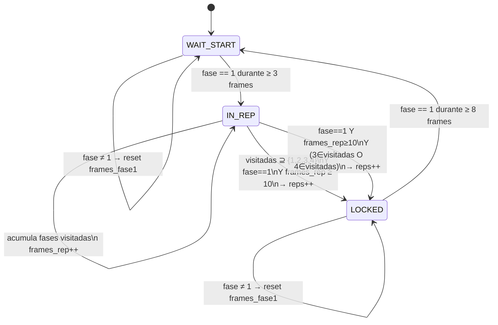

#### Dominada Neutro — apertura/cierre por fase

```python
si rep is None y fase == 1:
    rep = {"angulos": [], "mensajes": [], "penalizacion": 0}

si rep existe:
    rep["angulos"].append(ang)
    evaluar_fase(fase, vel, acc, rep)

    si len(rep["angulos"]) > 25 y fase == 1:
        # Cerrar repetición y calcular score
        reps.append(rep)
        rep_count += 1
        rep = None
```

#### Dominada Abierto — FSM de 4 estados

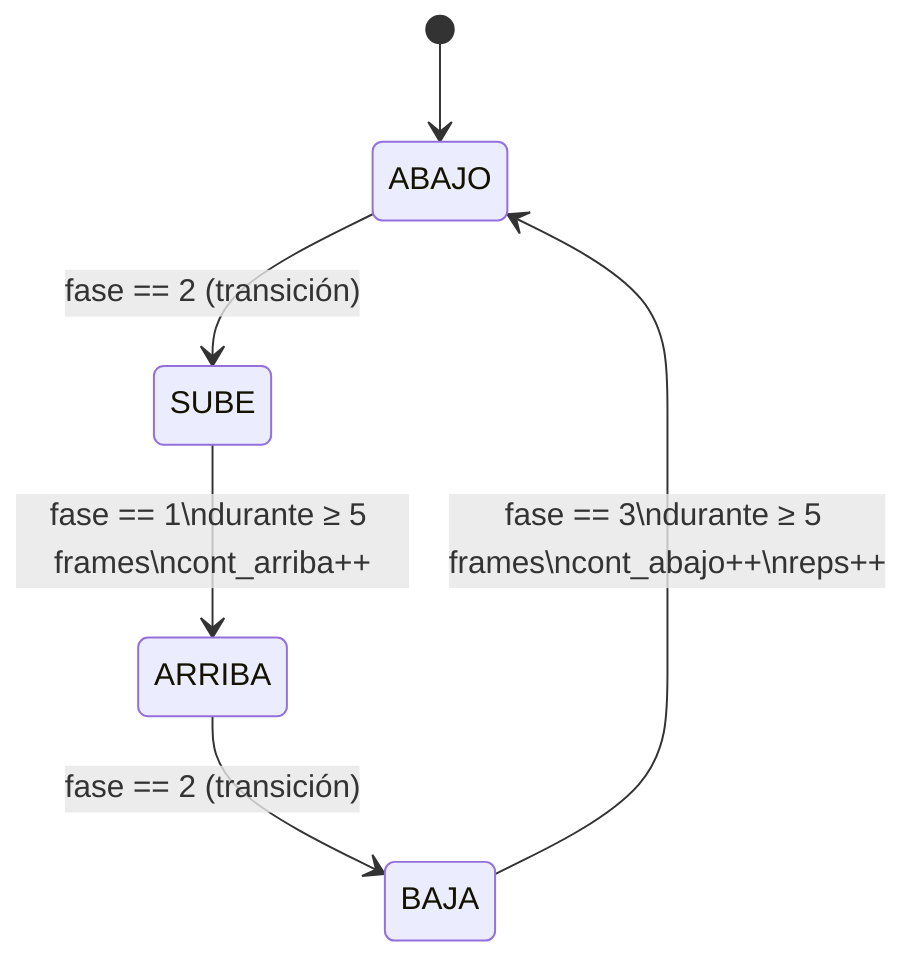

---

## 6. Pipeline de evaluación

Los scripts `evaluacion_*.py` validan el modelo comparándolo contra un **Ground Truth algorítmico** (no anotaciones humanas) sobre un video de prueba.

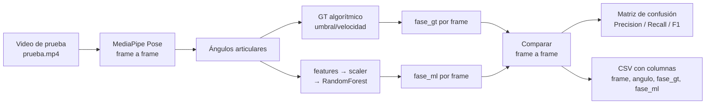

**Ground Truth usado en evaluación:**

- **Wall Push-Up:** GT híbrido basado en velocidad del codo (v_c < 0 → descenso, ≥ 0 → subida) + umbrales de posición relativa al rango máximo observado, con amplitudes empíricas por fase.

- **Dominada Neutro:** Misma función `fase_por_curva` usada en entrenamiento — umbral 20%/80% sobre ventana de 20 frames.

- **Dominada Abierto:** `fase_biomecanica` basada en ángulo normalizado al rango global del video (`ang_min`, `ang_max` pre-calculados) y umbral de velocidad:
  ```python
  si |vel| > 15°/s     → Fase 2 (movimiento)
  si ang_norm ≥ 0.75   → Fase 1 (arriba)
  si ang_norm ≤ 0.25   → Fase 3 (abajo)
  sino                 → Fase 2
  ```

> La evaluación mide si el modelo aprendió a replicar la lógica del GT algorítmico, **no** si predice correctamente desde un punto de vista biomecánico externo. La calidad depende de cuán bien el GT algorítmico describe la realidad.

---

## 7. Comparativa técnica por ejercicio

| Aspecto | Wall Push-Up | Dom. Agarre Neutro | Dom. Agarre Abierto |
|---------|-------------|---------------------|----------------------|
| **Archivo entrenamiento** | `entrenamiento_wall_pushup.py` | `entrenamiento_dominada_neutra.py` | `entrenamiento_dominada_abierta.py` |
| **Árbol de decisión** | RF 300 árboles | RF 400 árboles + balanceo | RF 400 árboles + balanceo |
| **Fases** | 4 | 3 | 3 |
| **Detección de reps** | Señal ponderada de ángulos | Flujo óptico vertical | Flujo óptico vertical |
| **Etiquetado fases** | Temporal fijo (proporciones de duración) | Umbral 20%/80% sobre ventana deslizante | Umbral relativo al máximo de la rep |
| **Nº features** | 3 (medias por fase) | 7 (ángulo + vel + acc + estadísticas) | 41 (estadísticas + derivadas temporales) |
| **Feature principal** | Ángulo medio de articulaciones | Ángulo codo derecho + dinámica | Ángulos bilaterales + apertura + tronco |
| **Balanceo de dataset** | No | Sobremuestreo bootstrap | No (class_weight="balanced") |
| **Suavizado de señal** | Filtro de Kalman | No | No |
| **Landmark principal** | lm[12,14,16] (codo derecho) | lm[12,14,16] (codo derecho) | lm[11–16, 23,24] (bilateral) |
| **Modelo faltante** | No | Sí — `modelo_fase_dominadas_rt.pkl` | No |
| **Vista cámara** | Lateral (perfil) | Frontal | Posterior |

---

## 8. Modelos ML — resumen

```mermaid
flowchart TD
    subgraph Wall_Push_Up
        A1[3 features\nCodo, Hombro, Espalda\nmedias por fase]
        A2[StandardScaler]
        A3[RF 300 árboles]
        A4[4 clases\nInicio/Descenso/Abajo/Subida]
        A1-->A2-->A3-->A4
    end

    subgraph Dominada_Neutro
        B1[7 features\nang + vel + acc\n+ estadísticas ventana]
        B2[Sobremuestreo bootstrap]
        B3[StandardScaler]
        B4[RF 400 árboles\nclass_weight=balanced]
        B5[3 clases\nAbajo/Movimiento/Arriba]
        B1-->B2-->B3-->B4-->B5
    end

    subgraph Dominada_Abierto
        C1[41 features\n5 ángulos × estadísticas\n+ velocidades/aceleraciones]
        C2[StandardScaler]
        C3[RF 400 árboles\nclass_weight=balanced]
        C4[3 clases\nArriba/Transición/Abajo]
        C1-->C2-->C3-->C4
    end
```

---

## 9. Estructura de archivos y artefactos

```
Correccion-de-Postura-en-tiempo-real/
│
├── README.md                              ← Entrada principal del proyecto
├── requirements.txt                       ← Dependencias Python
├── CLAUDE.md                              ← Notas operativas para asistentes
│
├── docs/
│   ├── README.md                          ← Índice de documentación
│   ├── DOCUMENTACION_TECNICA.md           ← Este documento
│   └── ESTADO_PROYECTO.md                 ← Estado actual y problemas activos
│
├── deteccion_automatica.py              ← Punto de entrada. Detecta ejercicio y lanza script.
│
├── entrenamiento_wall_pushup.py         ← Genera modelos/wall_pushup/
├── entrenamiento_dominada_neutra.py
├── entrenamiento_dominada_abierta.py
│
├── evaluacion_wall_pushup.py            ← Valida GT vs ML. Requiere videos/*/prueba.mp4
├── evaluacion_dominada_neutra.py
├── evaluacion_dominada_abierta.py
│
├── retroalimentacion_wall_pushup.py     ← Inferencia en tiempo real. Carga modelos/wall_pushup/
├── retroalimentacion_dominada_neutra.py
├── retroalimentacion_dominada_abierta.py
│
├── core/                                ← Paquete compartido (sin duplicación)
│   ├── geometria.py                     ← calcular_angulo, distancia
│   ├── pose.py                          ← nueva_pose (wrapper MediaPipe), índices landmarks
│   ├── senales.py                       ← flujo_vertical (optical flow), suavizar_kalman
│   ├── dinamica.py                      ← vel_ang, acc_ang, *_safe, fase_por_curva (neutra)
│   ├── features.py                      ← features_frame de 41 features (abierta)
│   └── config.py                        ← rutas centralizadas (modelos/, videos/)
│
├── modelos/
│   ├── wall_pushup/
│   │   ├── modelo_fase.pkl              ← RF entrenado (300 árboles, 3 features, 4 clases)
│   │   ├── scaler_fase.pkl              ← StandardScaler ajustado en entrenamiento
│   │   └── rangos_por_fase.npy          ← Dict {fase: {articulacion: {min, max, mean}}}
│   │
│   ├── dominada_neutra/
│   │   ├── modelo_fase_dominadas_rt.pkl ← FALTANTE — bloquea ejecución
│   │   ├── scaler_fase_dominadas_rt.pkl ← Presente
│   │   └── rangos_por_fase.npy          ← Presente (no usado en retroalimentación)
│   │
│   └── dominada_abierta/
│       ├── modelo_fases.pkl             ← RF entrenado (400 árboles, 41 features, 3 clases)
│       ├── scaler_fases.pkl             ← StandardScaler ajustado en entrenamiento
│       └── dataset_fases.csv            ← Dataset de entrenamiento serializado
│
└── videos/                              ← NO en repo (en .gitignore). Requerido para entrenar/evaluar.
    ├── wall_pushup/
    ├── dominada_neutra/
    └── dominada_abierta/
```

**Dependencias Python:**

```
opencv-python   — captura de video, procesamiento de imagen, flujo óptico
mediapipe       — detección de pose (BlazePose)
numpy           — álgebra vectorial, operaciones sobre arrays
pandas          — manipulación de DataFrames, rolling mean
scipy           — find_peaks para detección de repeticiones
pykalman        — filtro de Kalman para suavizado (Wall Push-Up)
scikit-learn    — RandomForestClassifier, StandardScaler, métricas
joblib          — serialización de modelos (.pkl)
```

Versiones fijadas por compatibilidad:

```
Python 3.11
mediapipe==0.10.14
scikit-learn==1.6.1
```

`scikit-learn==1.6.1` coincide con la versión usada para serializar los modelos `.pkl` versionados; cargar esos modelos con versiones más nuevas puede producir advertencias o resultados no garantizados.

---

## 10. Limitaciones conocidas

### Bugs corregidos en el refactor

| Bug | Archivo | Estado |
|-----|---------|--------|
| `import os` faltante | `deteccion_automatica.py` | Corregido (ya importa `os`) |
| Orden de features distinto entre entrenamiento e inferencia (neutra) | `retroalimentacion_dominada_neutra.py`, `evaluacion_dominada_neutra.py` | Corregido (orden unificado) |
| Ángulo de espalda siempre 0° (puntos iguales) | `entrenamiento_wall_pushup.py`, `retroalimentacion_wall_pushup.py`, `evaluacion_wall_pushup.py` | Corregido en código; requiere reentrenar el modelo |
| Nombres de columnas faltantes para scaler de Wall Push-Up | `retroalimentacion_wall_pushup.py`, `evaluacion_wall_pushup.py` | Corregido (`Codo_mean`, `Hombro_mean`, `Espalda_mean`) |
| Mapeo de fases invertido en evaluación de dominada abierta | `evaluacion_dominada_abierta.py` | Corregido (`1=Arriba`, `2=Movimiento`, `3=Abajo`) |

> Nota sobre `acc_ang`: tiene el mismo cuerpo que `vel_ang` pero recibe el historial de **velocidades**, por lo que sí calcula aceleración. No era un bug; se documenta como alias en `core/dinamica.py`.

### Pendientes

- **Modelo faltante:** `modelos/dominada_neutra/modelo_fase_dominadas_rt.pkl` no existe en el repositorio. `retroalimentacion_dominada_neutra.py` y `evaluacion_dominada_neutra.py` llaman a `joblib.load()` a nivel de módulo, por lo que fallan al ser importados o ejecutados hasta recuperar/reentrenar el modelo.
- **Reentrenar wall push-up:** el modelo versionado se entrenó con la feature de espalda en `0.0`; reentrenar con `entrenamiento_wall_pushup.py` para incorporar la inclinación del tronco ya corregida.

### Diseño de Ground Truth

El etiquetado de fases de entrenamiento no usa anotaciones biomecánicas externas ni un especialista. Se basa en heurísticas geométricas y temporales. Esto implica:

- El modelo aprende a replicar la heurística, no la biomecánica real.
- Si los videos de entrenamiento tienen ejecuciones atípicas, los rangos capturados serán incorrectos.
- El método de la Wall Push-Up (segmentación temporal fija) es el más frágil: una repetición lenta o rápida recibe las mismas proporciones de fase que una a velocidad normal.

### Dependencia de cámara y videos

Los scripts de retroalimentación asumen `cv2.VideoCapture(0)` disponible. En entornos sin cámara (servidores, CI/CD) no pueden validar el flujo real. Los scripts de entrenamiento y evaluación dependen de archivos en `videos/`, carpeta que no está versionada en el repositorio.

### Invarianza de escala espacial

Los ángulos articulares son invariantes a la distancia del usuario a la cámara. Sin embargo, la feature `grip` (distancia euclidiana en píxeles entre muñecas) en Dominada Abierto **sí depende de la distancia a la cámara**. Un usuario más lejos producirá un `grip` menor para el mismo agarre real.
